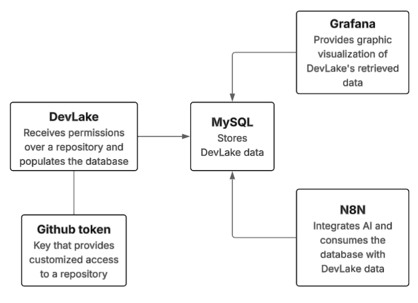
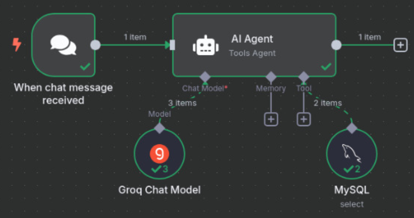
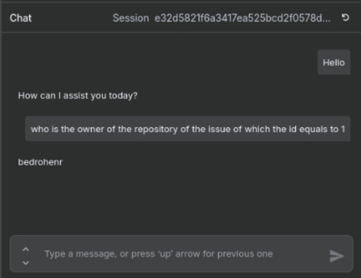
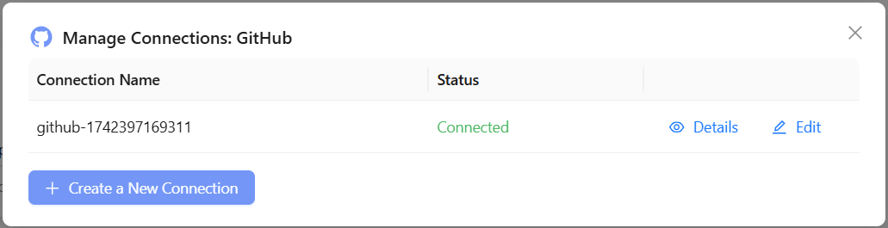
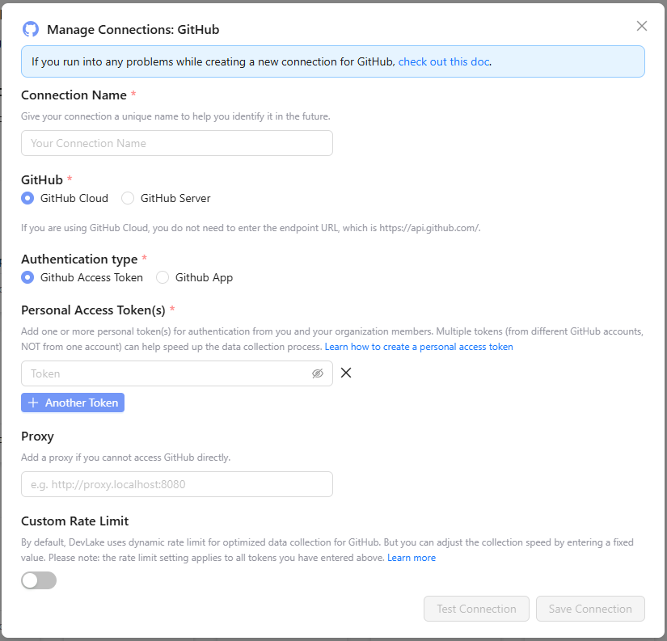
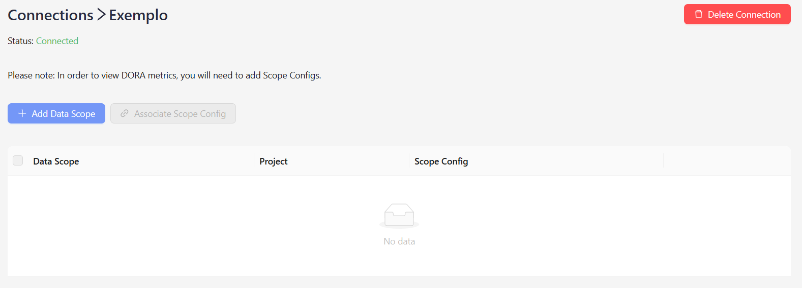
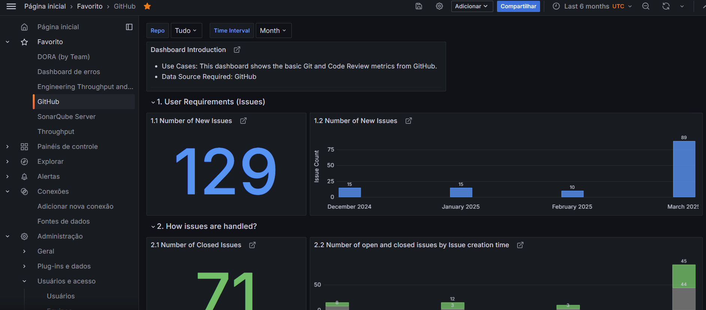

# Oráculo

Este projeto almeja desenvolver uma plataforma de chatbot para agilizar e simplificar respostas de perguntas sobre o estado das tarefas de uma equipe de desenvolvimento.

Para este fim, planejamos integrar ferramentas como repositório do Github, JIRA... e utilizando uma IA para fazer queries SQL e retornar a resposta certa.

## Sobre o projeto

Um chatbot que utiliza a IA para pesquisar em um banco com  dados, de ferramentas integradas (Github, JIRA, ...), afim de agilizar uma resposta à uma pergunta do tipo: O que **membro da equipe de desenvolvimento** está trabalhando agora?

Criado para simplificar o processo de gerenciamento de uma equipe.

## Requerimentos

- Docker e Docker Compose instalados 
- Um **GitHub Access Token**, Token de acesso do Github para integração do mesmo.
   - Disponível em (enquanto logado em [Github.com](Github.com)): [Github Personal Access Tokens](https://github.com/settings/personal-access-tokens)
- Um **Groq API Key**, chave de acesso do [Groq](groq.com) .
   - Disponível em (enquanto logado em [GroqCloud](https://console.groq.com)): [Groq API Keys](https://console.groq.com/keys).

## Ferramentas

### DevLake

**DevLake** é uma plataforma de engenharia de dados projetada para coletar, armazenar e analisar dados de desenvolvimento de software de diversas ferramentas.

Acessível em: [localhost:4000](localhost:5678)

### MySQL

Sistema de gerenciamento de banco de dados (SGBD) de código aberto, que permite armazenar e gerir dados estruturados.

Utilizado para armazenar os dados do **DevLake**.

### Grafana

Ferramenta de análise e visualização de dados de código aberto.

Utilizado para visualizar os dados no **MySQL** populado pelo **DevLake**.

Acessível em: [localhost:4000/grafana](localhost:5678)

### N8N

[N8N](https://github.com/n8n-io/n8n) é uma plataforma de automação de fluxo de trabalho de código aberto que oferece às equipes técnicas a flexibilidade do código com a velocidade do no-code.

Neste repositório, usaremos essa plataforma para integrar diferentes sistemas de monitoramento do fluxo de trabalho da equipe.

Acessível em: [localhost:5678](localhost:5678)

## Funcionamento

Por agora, ainda em desenvolvimento, o DevLake é usado para popular a database (MySQL) vinculando o repositório escolhido (estamos utilizando o Github).

Assim podendo tentar fazer com que o n8n, junto de um AI Agent, consiga fazer queries na database com os issues e commits.

#### Supersimplificação do fluxo de execução:

   


Desta forma, podemos conectar o n8n ao MySQL e fazer com que a AI Agent possa lidar com os dados. 

#### Exemplo de um rag do n8n:

   

Esta configuração nos proporciona a capacidade de fazer perguntas como esta:

   


## Instalação

1. Clone o repositório do DevLake:

   ```sh
   git clone https://github.com/leds-org/oraculo.git
   cd oraculo
   ```

2. Configure as variáveis necessárias nos arquivos `docker-compose.yml` e `.env`.

3. Gere o `ENCRYPTION_SECRET` executando o comando a seguir: 

   ```sh
   openssl rand -base64 2000 | tr -dc 'A-Z' | fold -w 128 | head -n 1
   ```

   Copie a sequência de caracteres gerada e cole em **ENCRYPTION_SECRET** no arquivo **[.env](./.env)**

4. Inicie o projeto rodando o comando:

   ```sh
   docker-compose up -d
   ```

   Isso iniciará todos os contêineres (DevLake, ConfigUI, Nginx, MySQL, Grafana) necessários para executar o ambiente DevLake e o N8n, que será usado para integrar a IA para pesquisar no banco de dados MySQL.

5. Acesse o Dashboard DevLake em [`http://localhost:4000`](http://localhost:4000).  
   - Use o **username** e **password** configurados préviamente no arquivo  `docker-compose.yml` para prosseguir.

6. Os demais serviços iniciam-se sozinhos.

## Credenciais
   - ### Devlake:
      - **Username**: devlake
      - **Password**: 123
   - ### MySQL
      - **Database**: lake
      - **Username**: merico
      - **Password**: 123
   - ### Grafana
      - **Username**: admin
      - **Password**: admin

## Configuração e Integração

### Criando uma conexão GitHub

1. No menu lateral, clique em **Conections**. 
2. Selecione **GitHub** e clique em **Create a New Connection**.

   

3. Preencha as informações necessárias e insira o **GitHub Access Token** para autenticação.

   

4. Teste a conexão clicando em **Test Connection**.  
5. Clique em **Save Connection**. Após salvar, você será redirecionado para a tlea de conexões:

   

6. Clique em **+ Add Data Scope**, selecione o repositório desejado, e clique em  **Save**.

### Criando um projeto

1. No menu lateral, clique em **Projects** e logo após em **+ New Project**.  
2. Insira o nome do projeto e clique em **Save**.  
3. Quando estiver editando o projeto, na seção **Data Connection**, clique em **+ Add a Connection**.  
4. Selecione a conexão previamente criada, escolha o repositório desejado e clique em **Save**.  
5. Ajuste a frequência de sincronização dos dados no menu **Sync Policy**, dentro do projeto.

Seu ambiente DevLake agora está configurado e pronto para uso!

## Visualização de dados com Grafana

DevLake usa o **Grafana** para mostrar os dados coletados.

1. Accesse o Grafana em [`http://localhost:4000/grafana`](http://localhost:4000/grafana).  
2. Use as credenciais padrão **admin:admin** para logar (É recomenddado trocar a senha após o primeiro login).  
3. Accesse o dashboard principal do Grafana:

   

4. No menu lateral, clique em **Dashboards** para visualizar os dashboards disponíveis.

   Example of a GitHub dashboard:

   

## Utilizando o N8N

1. Acesse o aplicativo em [localhost:5678](localhost:5678)

2. Crie uma conta, na primeira vez que abrir o app pelo link [localhost:5678](https://console.groq.com/keys)

3. Insira suas informações: Email, primeiro e último nome, senha e clique em **Next**.
   - O email inserido não será verificado pois o sistema está rodando localmente, porém, recomendamos inserir um email válido em caso de necessitar do login novamente.

4. No modal seguinte pressione **Get Started** e no modal após desse clique em **Skip**.

5. Na aba **Workflows**, clique em **Start from scratch**.

6. Na tela de edição do rag, clique nas reticências no topo a direita > Import from File...
   - Selecione o arquivo em [assets/json/n8n_data.json](assets/json/n8n_data.json) e importe-o

7. Dê um clique duplo no círculo **Groq Chat Model**, clique em select credential e logo após **+ Create new credential** e insira **sua** Chave de API do Groq

8. Dê um clique duplo no círculo **MySQL**, e insira as credenciais :
   - **Host**: mysql
   - **Database**: lake
   - **User**: merico
   - **Password**: 123
   - Clique no botão **Save**, se o teste de conexão der certo aparecerá uma mensagem de sucesso na tela.
   
9. Volte à tela de edição do rag e clique em **Open chat**

10.  Faça perguntas no chat e o **AI Agent** deve responder. 